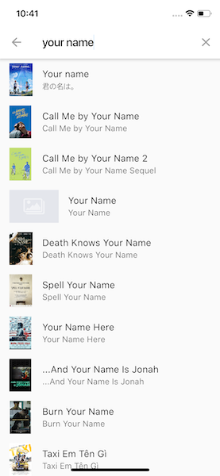

# Películas App

Proyecto en el que se aplican gran cantidad de conocimientos de Flutter. Se utilizaron widgets básicos como Container, Column, Image, así como otros no tan comunes como el Hero widget, Slivers, Search Delegator y muchos más.

## API

Este proyecto se llevó a cabo utilizando la API [The movie DB](https://www.themoviedb.org). La cual proporciona una inmesa cantidad de información sobre películas (populares, en carteleras, búsqueda, etc).

## Screenshots

#### Página principal

#### Detalle de la película

#### Búsqueda de películas

