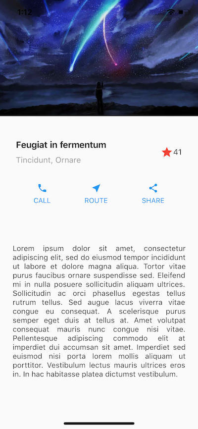
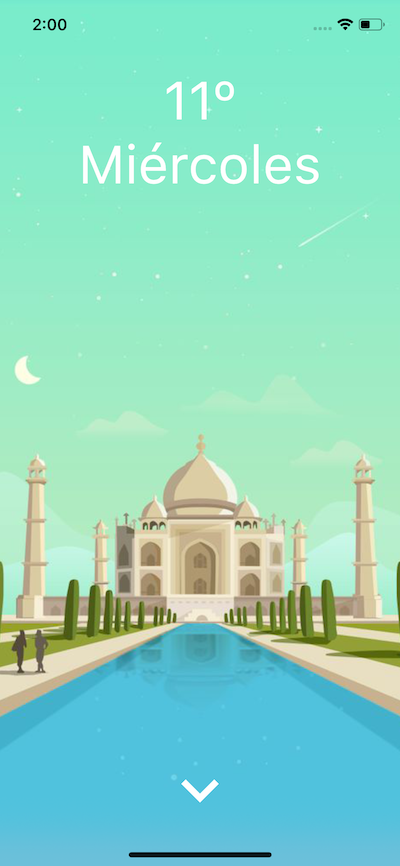
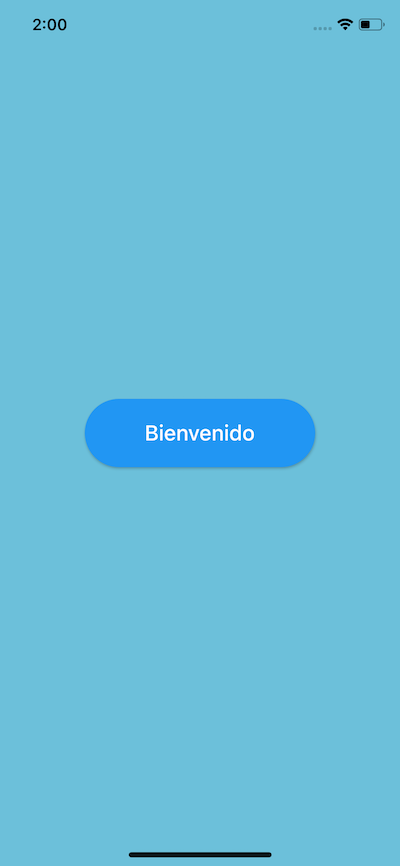
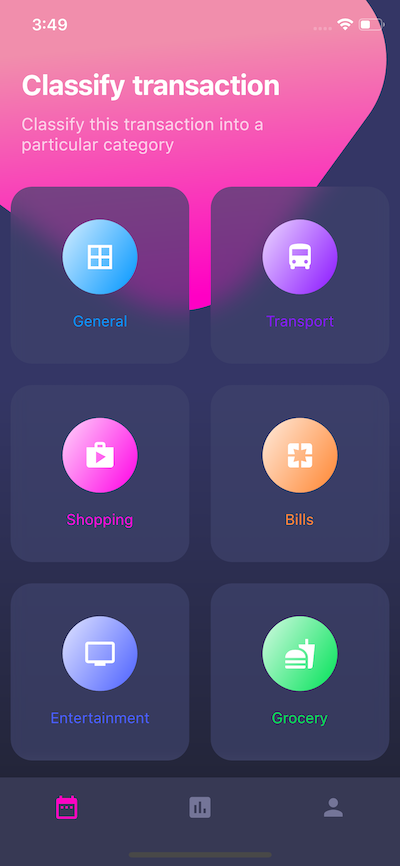

# Práctica de diseños

El objetivo principal de este proyecto fue desarrollar la visión para transformar un diseño previamente creado, en una aplicación de Flutter.

## Diseño básico - Recomendado por Flutter 

## Diseño intermedio - Con PageViews e imágenes

## Diseño avanzado - Con blur, grids background y más

